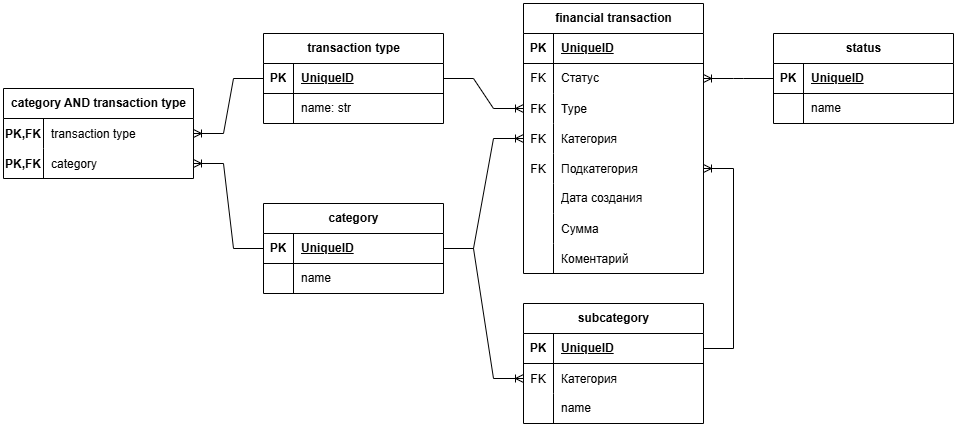

# Веб-сервис для управления движением денежных средств 
## Описание 
ДДС (движение денежных средств) — это процесс учета, управления и анализа поступлений и списаний денежных средств компании или частного лица. В рамках данного задания пользователь должен иметь возможность вести учет всех денежных операций.

Для использования приложения необходимо иметь доступ к аккаунту **суперпользователя**.

## Основные требования

Описание данных:
- Дата создания записи — заполняется автоматически, но может быть изменена вручную. Пример записи — 01.01.2025.
- Статус — например, имеет следующие значения: "Бизнес", "Личное" или "Налог". Данный список должен иметь возможность расширяться.
- Тип — например, имеет следующие значения: Пополнение, Списание. Данный список должен иметь возможность расширяться.
- Категория и подкатегория — например:
    - Категория “Инфраструктура” (подкатегории: "VPS", "Proxy")
    - Категория “Маркетинг” (подкатегории: "Farpost", "Avito")
    - Данный список должен иметь возможность расширяться.
- Сумма — количество средств в рублях, например, 1 000 р.
- Комментарий — комментарий к записи в свободной форме (необязательный).

Функции:
- Управление транзакциями
    - Просмотр списка всех записей
        - Вывод таблицы с данными: дата, статус, тип, категория, подкатегория, сумма, комментарий.
        - Поддержка фильтрации по дате (с указанием периода дат), статусу, типу, категории и подкатегории.
    - Редактирование, удаление записи
- Управление справочниками
    - Добавление, редактирование и удаление статусов, типов, категорий и подкатегорий.
- Логические зависимости
    - Подкатегории должны быть привязаны к категориям.
    - Категории должны быть привязаны к типам.

На основе этих данных была принята к реализации следующая БД. 


Основные страницы веб-приложения:
- Главная страница:
    - Таблица с записями о ДДС.
    - Фильтры по дате, статусу, типу, категории и подкатегории.
- Страница создания/редактирования записи:
    - Форма для ввода данных.
    - Поле выбора категорий, автоматически фильтрующее подкатегории на основе выбранной категории.
- Страница управления справочниками:
    - Добавление, редактирование и удаление статусов, типов, категорий и подкатегорий, а также установление необходимых зависимостей.

Бизнес-правила:
- **Пользователь не может выбрать подкатегорию, если она не связана с
выбранной категорией.**
- **Пользователь не может выбрать категорию, если она не относится к
выбранному типу**

Валидация данных:
- Поля "сумма", "тип", "категория" и "подкатегория" обязательны.
- Валидация на стороне клиента и сервера.

Ограничения:
- Технологии:
    - Python, Django, Django ORM
    - для создания frontend-части данного веб-приложения можно воспользоваться стандартной админ-панелью джанго или разработать собственный интерфейс с использованием HTML, CSS (Bootstrap), JavaScript.
- Срок 5 дней.

## Запуск 

> :warning: **Это исключительно для разработки, не для "продакшена"**!

Установка зависимостей.
```shell
pip -r requirements.txt
```

Миграция базы данных.
```shell
python manage.py migrate
```

Создание суперпользователя. Важно для взаимодействия с приложением, т.к. требований к правам - нет. 
```shell
python manage.py createsuperuser
```

Запуск сервера.
```shell
python manage.py runserver
```

## Ссылки

Автозаполнение в django admin:
https://forum.djangoproject.com/t/dependent-drop-down/16558
https://stackoverflow.com/questions/57143113/how-to-use-the-admin-autocomplete-field-in-a-custom-form
 
